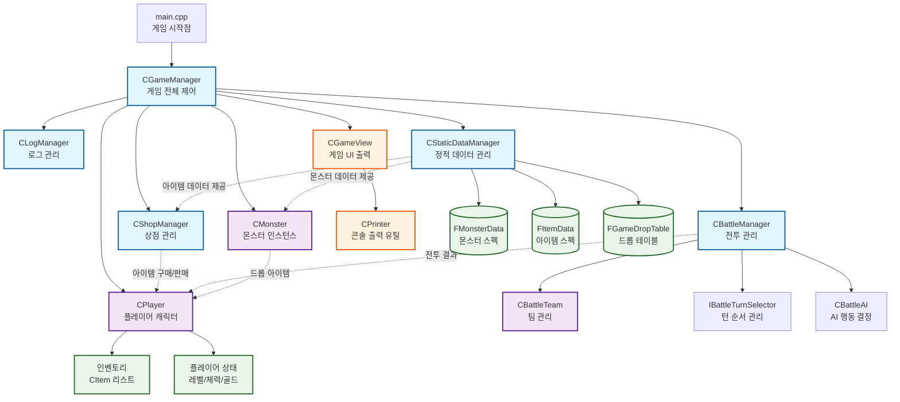
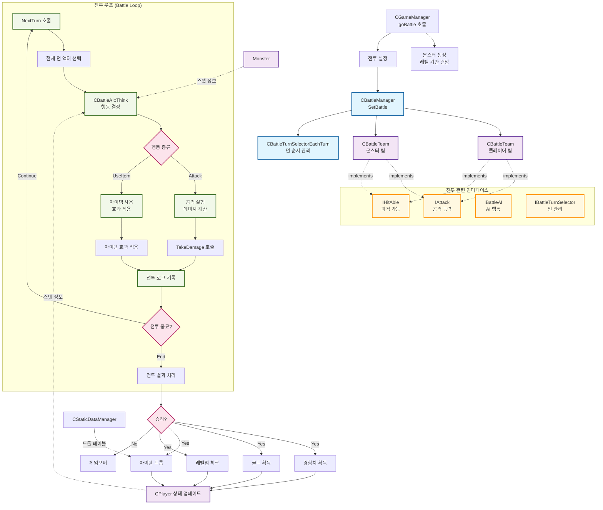

## 목차

- [1. 구현 내용](#구현-내용)
- [2. 변형](#구현과-다르게-된-내용)

### 구현 내용.

1. ##### **캐릭터 생성 및 관리**
   - 원하는 이름으로 캐릭터를 하나 뿅! 만들 수 있어야 합니다.
   - **레벨 1**, **초기 체력 200**, **공격력 30**, **경험치 0**으로 시작하고, 레벨업에 필요한 경험치는 **100** 고정!
   - 언제든지 캐릭터 상태 확인 가능!
2. ##### **레벨업 효과**
   - 레벨이 오를 때마다 체력과 공격력이 폭발적으로(?) 상승합니다.
   - **체력**: `(현재 체력 + (레벨 × 20))`, **공격력**: `(현재 공격력 + (레벨 × 5))`
   - 레벨업 시 체력은 최대치까지 완전히 회복!
   - 최대 레벨은 **10으로 제한.**
3. ##### **전투 시스템**
   - 랜덤으로 출몰(?)하는 몬스터와 턴제로 싸웁니다.
   - 전투 시작 조건:
     - 캐릭터 생성 직후
     - 전투 승리 후 상점 방문을 스킵하거나, 상점 이용 후
   - 전투 승리: 경험치 50 획득 & 10~20 골드 랜덤 획득
   - 경험치 누적 100 이상 → 자동 레벨업
4. ##### **몬스터 설명**
   - 몬스터도 이름, 체력, 공격력을 가집니다.
   - 몬스터 스펙은 캐릭터 레벨에 비례해서 랜덤하게 생성:
     - 체력: (레벨 × 20) ~ (레벨 × 30)
     - 공격력: (레벨 × 5) ~ (레벨 × 10)
5. ##### **아이템 및 골드 관리**
   - 전투에서 이기면 골드를 얻고, 가끔(30% 확률) 아이템이 떨어집니다.
   - 아이템은 **체력 +50** 또는 **공격력 +10**을 해주는 멋진 효과!
   - 전투 중에는 "이럴 때 아이템!" 하고 랜덤하게 사용됩니다. (디테일은 자유롭게!)
   - 아이템은 사용 순간 사라지고, 효과는 바로 캐릭터에게 반영됩니다.
6. ##### **게임 로그 확인**
   - “전투? 아이템 사용? 골드 획득?” 중요한 이벤트는 콘솔에 쭉 기록됩니다.
   - 로그를 통해 오늘 어떤 몬스터를 몇 마리 눕혔는지~ 한 눈에 확인 가능!
7. ##### **게임 화면**

   - 캐릭터 생성 및 상태 확인
     > 캐릭터 이름을 입력하세요: Hero
     > 캐릭터 Hero 생성 완료! 레벨: 1, 체력: 100, 공격력: 10
   - 일반 몬스터와의 전투
     > 몬스터 Goblin 등장! 체력: 40, 공격력: 8
     > Hero가 Goblin을 공격합니다! Goblin 체력: 30
     > Goblin이 Hero를 공격합니다! Hero 체력: 92
     > Hero가 Goblin을 공격합니다! Goblin 처치!
     > Hero가 50 EXP와 12 골드를 획득했습니다. 현재 EXP: 50/100, 골드: 12
   - 주인공 사망으로 게임 종료
     > 몬스터 Dragon 등장! 체력: 450, 공격력: 50
     > Dragon이 Hero를 공격합니다! Hero 체력: 50 → 0
     > Hero가 사망했습니다. 게임 오버!

8. ##### **몬스터 보스전**
   - **레벨 10 달성** 시, 이제 일반 몬스터는 상대도 안 된다!
   - “보스 몬스터”가 짜잔~ 등장합니다.
   - 체력·공격력은 기존 몬스터의 **1.5배** 범위를 랜덤으로 설정!
   - 보스 클리어하면 “축하합니다! 게임 엔딩을 보셨습니다!”
9. ##### **상점 시스템**
   - 전투가 끝나면 “상점을 방문하시겠습니까? (Y/N)” 물어보기
   - 상점에서는 골드로 아이템을 구매/판매 가능(아이템 목록은 자유롭게!)
     - 아이템 구매
       - 플레이어는 골드를 사용해서 아이템을 구매
       - 구매 아이템은 인벤토리에 즉시 추가
     - 아이템 판매
       - 플레이어는 보유한 아이템을 골드로 판매 **(판매 가격은 구입 원가의 60%!)**
       - 판매된 아이템은 인벤토리에서 즉시 제거
   - “체력 물약 10 Gold”, “공격력 강화 15 Gold”처럼 가격을 정해놓기!
   - 구매 즉시 인벤토리에 들어오며, 판매 시 아이템이 소멸되고 골드 획득!
   - 즉, 상점 시스템을 추가한다는 것은 곧 인벤토리도 있어야겠네요?
     - 캐릭터 클래스의 멤버 변수를 참고해보세요!
10. ##### **게임 화면**
    - 전투 종료 후 상점 방문 선택
      > 전투에서 승리했습니다! 50 EXP와 15 골드를 획득했습니다. 현재 EXP: 50/100, 골드: 15
      > 상점을 방문하시겠습니까? (Y/N): Y
      > 상점에 오신 것을 환영합니다!
      > 구매 가능한 아이템:
      >
      > 1. Health Potion (체력 +50): 10 골드
      > 2. Attack Boost (공격력 +10): 15 골드
      >    골드: 15
      >    구매할 아이템 번호를 선택하세요: 1
      >    Health Potion을 구매했습니다!
    - 보스 몬스터 전투
      > 보스 몬스터 Dragon 등장! 체력: 450, 공격력: 45
      > Hero가 Dragon을 공격합니다! Dragon 체력: 400
      > Dragon이 Hero를 공격합니다! Hero 체력: 150
      > Hero가 Health Potion을 사용했습니다. Hero 체력: 200
      > Hero가 Dragon을 공격합니다! Dragon 처치!
      > 축하합니다! 보스 Dragon을 처치하고 게임을 클리어했습니다!

### 구현과 다르게 된 내용

1. **장비 있음**

   - 장비 아이템이 드롭 되서 장비를 장착, 해제 할 수 있고 스탯이 그에 맞게 오르고 내림,

2. **보스 몬스터는 그냥도 등장**

   - 종료 조건은 10레벨을 넘어서 보스를 처치하는 것 10레벨이 넘어가면 항상 보스가 등장 합니다.

3. **사용 아이템**
   - 기본 사용 아이템은 없습니다 본문의 [사용아이템](#아이템-및-골드-관리)
   - 대신 소지한 포션 아이템을 10% 확률로 사용합니다!.
   - 포션과 장비는 사전에 정의된 드롭 테이블에 맞춰서 그려집니다.

